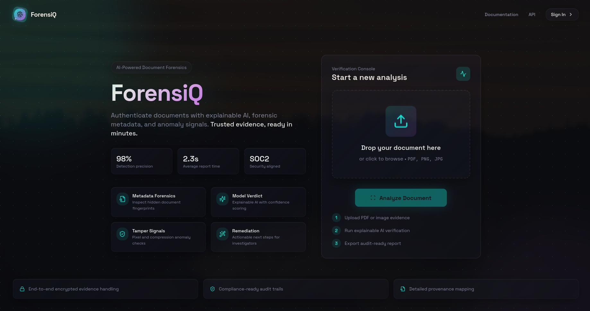
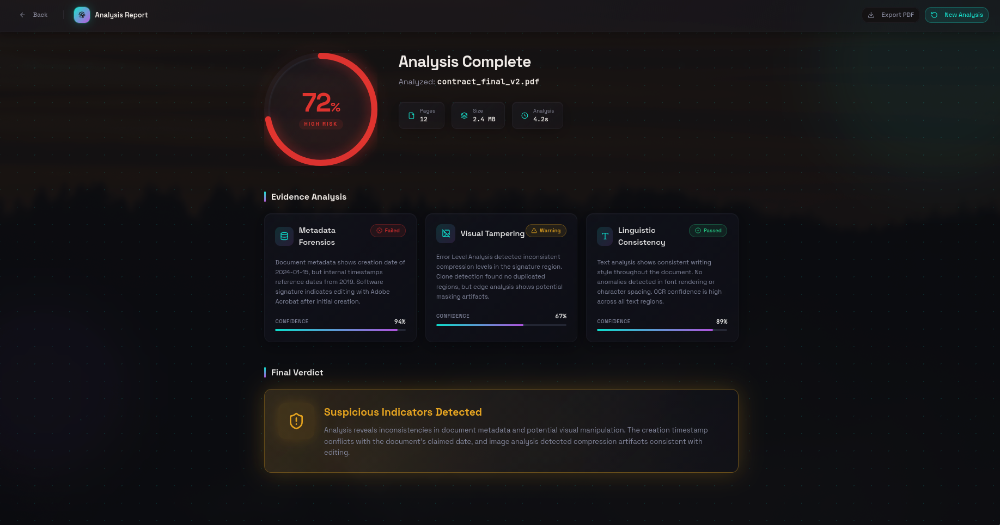
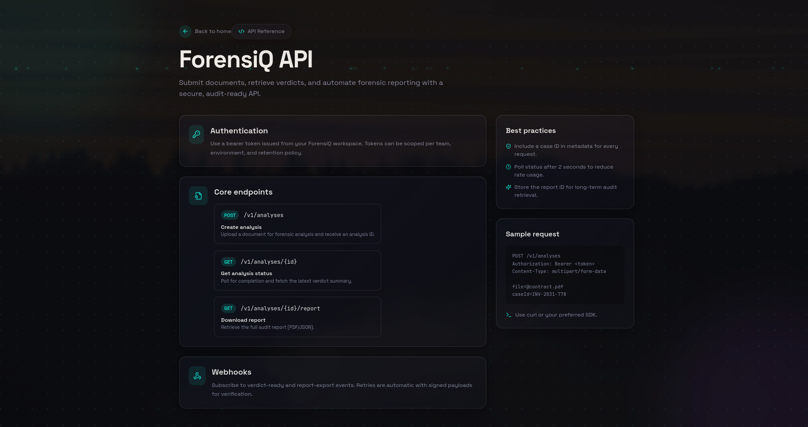

<div align="center">

# ForensiQ

### Explainable AI for Document Forensics

**Authenticate documents with AI-powered forensic analysis. Trusted evidence, ready in minutes.**

[](https://reactjs.org/)
[](https://www.typescriptlang.org/)
[](https://tailwindcss.com/)
[](https://vitejs.dev/)



</div>

---

## Overview

ForensiQ is an AI-assisted document forensics platform designed to help organizations verify the authenticity of digital and scanned documents before acceptance or legal use. Built on the principle of **human-AI collaboration** — it augments human expertise rather than replacing it, making it practical, ethical, and enterprise-deployable.

| Metric | Value |
|--------|-------|
| Detection Precision | **98%** |
| Average Report Time | **2.3s** |
| Security Compliance | **SOC2 Aligned** |

---

## Key Features

- **Explainable AI Verdicts** — Clear reasoning and confidence scores behind every authenticity decision
- **Metadata Forensics** — Deep inspection of hidden document fingerprints and properties
- **Tamper Detection** — Pixel-level analysis for visual manipulations and compression anomalies
- **Linguistic Consistency** — Text analysis for writing style anomalies and OCR validation
- **Audit-Ready Reports** — Exportable PDF/JSON reports for legal and compliance use
- **REST API** — Integrate forensic analysis directly into your workflows

---

## Screenshots

### Analysis Report
> Evidence-backed verdicts with per-signal confidence scores and a clear final verdict.



### API Reference
> A clean, developer-friendly API for submitting documents and automating forensic reporting.



---

## Getting Started

### Prerequisites

- [Node.js](https://nodejs.org/en/) v18 or higher
- [pnpm](https://pnpm.io/) (recommended) or npm

### Installation

```bash
# Clone the repository
git clone <your-repository-url>
cd ForensiQ

# Install dependencies
pnpm install

# Start the development server
pnpm dev
```

The development server will be available at `http://localhost:8080`.

---

## Available Scripts

| Command | Description |
|---------|-------------|
| `pnpm dev` | Start the development server |
| `pnpm build` | Build for production |
| `pnpm build:dev` | Build in development mode |
| `pnpm lint` | Lint with ESLint |
| `pnpm preview` | Preview the production build locally |
| `pnpm test` | Run the test suite |
| `pnpm test:watch` | Run tests in watch mode |

---

## API Overview

ForensiQ exposes a secure, audit-ready REST API for programmatic access:

```http
POST   /v1/analyses          # Submit a document for analysis
GET    /v1/analyses/{id}     # Poll analysis status
GET    /v1/analyses/{id}/report  # Download the full audit report (PDF/JSON)
```

**Authentication** uses bearer tokens scoped per team, environment, and retention policy. Webhook subscriptions are also available for verdict-ready and report-export events.

---

## Project Structure

```
.
├── public/              # Static assets & screenshots
├── src/
│   ├── components/
│   │   ├── ui/          # Shadcn UI components
│   │   └── ...          # Custom components
│   ├── hooks/           # Custom React hooks
│   ├── lib/             # Utility functions
│   ├── pages/           # Page components
│   ├── test/            # Test files
│   ├── App.tsx
│   └── main.tsx
├── index.html
├── tailwind.config.ts
├── vite.config.ts
└── package.json
```

---

## Ethics & Principles

ForensiQ is designed with responsible AI practices at its core:

- **Transparency** — Every AI decision includes clear explanations and confidence scores
- **Human Oversight** — Final decisions always remain with human experts
- **Bias Mitigation** — Regular auditing and diverse training data to reduce algorithmic bias
- **Privacy First** — Documents can be processed without permanent storage
- **Accessibility** — Designed for users with varying levels of technical expertise

---

<div align="center">

Built with care for investigators, compliance teams, and legal professionals.

</div>
